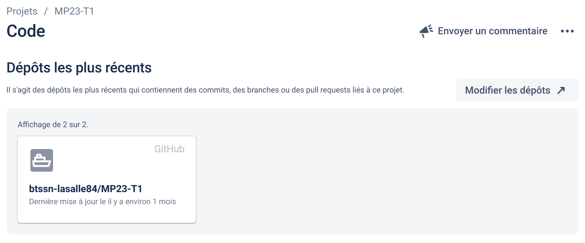
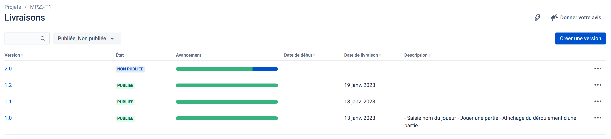
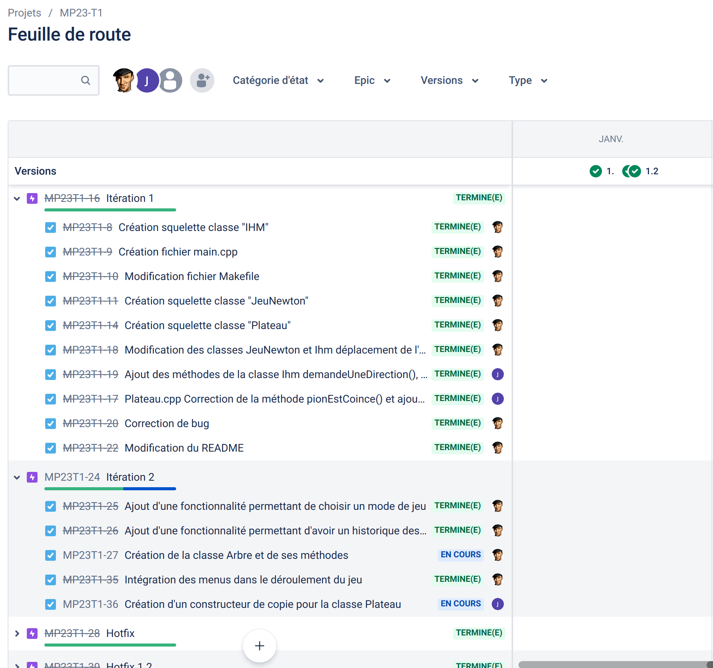

[](https://github.com/btssn-lasalle84/MP23-T2/actions/workflows/c-cpp.yml) [](https://github.com/btssn-lasalle84/MP23-T2/actions/workflows/cppformat.yml)

# Mini-projet : Cul de chouette

Le **[Cul de chouette](https://fr.wikibooks.org/wiki/Bo%C3%AEte_%C3%A0_jeux/Le_cul_de_chouette)** est un jeu originaire de la série [Kaamelott](https://fr.wikipedia.org/wiki/Kaamelott) et se joue avec trois dés à 6 faces. Le but du jeu est d'atteindre ou dépasser 343 points, le score à atteindre provenant des initiales du nom du jeu (CDC), soit les 3e, 4e et 3e lettres de l'alphabet.

Les points sont obtenus en utilisant des combinaisons grâce aux résultats des dés, par exemple : la Velute, la Chouette, la Suite, etc....

---

> Ceci est un mini-projet de 2 étudiants de BTS SN option Informatique & Réseaux développé en C++. L'objectif était la mise en oeuvre d'une méthode agile [Kanban](https://fr.wikipedia.org/wiki/Kanban_(d%C3%A9veloppement)) avec les outils **Jira / Github** et en appliquant le _workflow_ [Gitflow](https://btssn-lasalle84.github.io/guides-developpement-logiciel/jira.html#ancre-gitflow). L'application devait être limitée à une interface en ligne de commande (console).

---

Les régles du jeu sont issues du Wikibook https://fr.wikibooks.org/wiki/Bo%C3%AEte_%C3%A0_jeux/Le_cul_de_chouette. Le programme ne prend pas en compte des 'Crier'.

Actuellement, les régles programmées sont :

1. La Chouette.
2. La Velute.
3. Le Cul De Chouette.

## Jouer une Partie 

```bash
$ make
$ CulDeChouette.out
```

> La version 2.0 du programme permet désormais de saisir le nombre de parties que l'on veut jouer et le niveau de difficulté souhaité.

## Jira

Intégration avec Github :



### Les versions



### Feuille de route



## Auteurs

- Nathanaël   Chansard mailto:nathanaelchansard@gmail.com
- Mayeul      Fargier mailto:mayeulfargier.pro@gmail.com

---
©️ BTS SNIR LaSalle Avignon 2023
